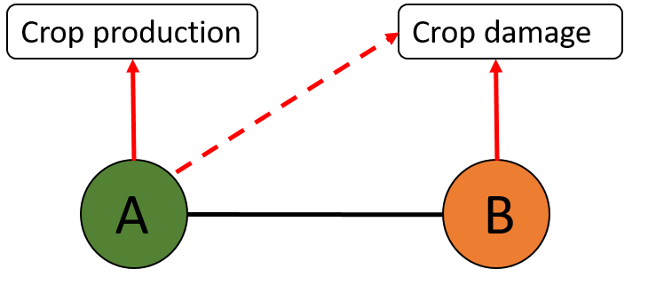
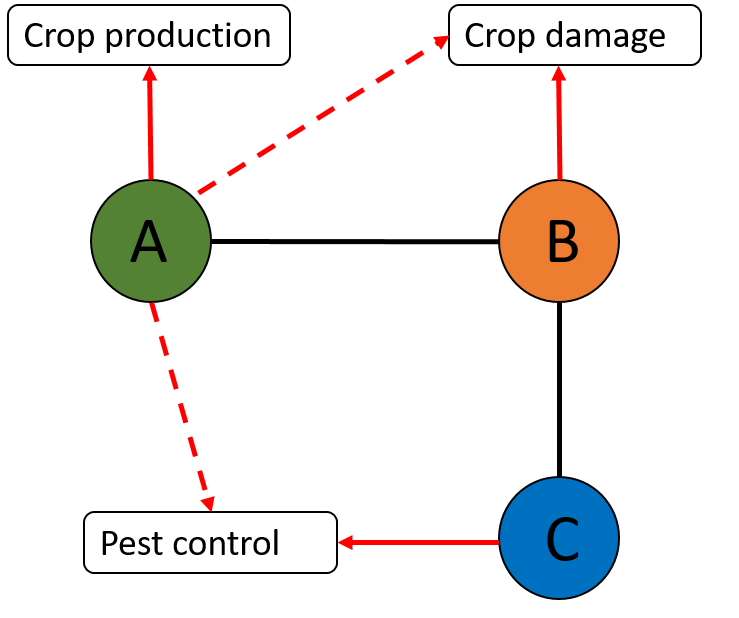

```{r setup, include=FALSE}
knitr::opts_chunk$set(echo = FALSE, results = "asis", message=FALSE, warning=FALSE, cache=TRUE, eval = TRUE, dev = c('png'), out.width = '100%', out.height='40%')

```

```{css}
/* Custom CSS to reduce TOC font size */
#TOC {
  font-size: 0.8em; /* Adjust the value to your preference */
}
```

```{r load libraries, echo=FALSE, message=FALSE, warning=FALSE}
library(tidyverse)
library(readr)
library(emln) #multilayer package
library(readr)
library(readxl)
library(ggplot2)
library(cowplot)
library(paletteer)
rm(list=ls())
```

\
\
\

# Open questions
\

<font size="4"> 
- **How many ES are provided by species and habitats? Is the indirect contribution of species on ES (indirect effects) greater than the direct provision? Does it change according to species trophic group?**</font> 
\
\
\

<font size="4"> 
- **How the direct (and indirect) provision of ecosystem (dis)service change according to habitat management? Is it related to the changes in the structure of the network?**</font> 
\
\
\

<font size="4"> 
- **Are some species more robust to habitat management? Are those that provide more direct and indirect ES?** </font> 
\
\
\
\
\
\


# Data (What we have)
\

<font size="3"> 
-  12 habitat types (6 cultivable, 6 uncultivated).</font>
\

<font size="3"> 
-  23 fields in total.</font>
\

<font size="3"> 
-  Records of antagonistic and mutualistic interactions. Abundances/area.</font>
\

<font size="3"> 
-  2 years</font>

\
\
\
\
\
\


# Provision of Ecosystem (dis)services {.tabset}
\

<font size="3">
We detected the direct provision of E(D)S by species and the potential indirect effects of species on E(D)S:
\

* **Direct E(D)S provision**: benefits (ES) or disadvantages (EDS) that result directly from the presence of a species.
\

* **Indirect effect on E(D)S provision**: impact of a species on ecosystem services or ecosystem disservices provided by another species.
\

## Network
<font size="3">
Multilayer network containing:

* Layers: Habitats.

* Nodes: Species. Associated attributes: trophic group and ES provided.

* Intralayer links: interaction between species. Binary: presence/absence. 

* No interlayer links (for now...).
\
\
\
\
\
\

## Method

We detected indirect effects of a target species on ecosystem services based on its neighbors. We calculated first and second order indirect interactions for each species.
\
\


### First-order indirect interactions (1 hop):
\
\



**Node A:**

Direct provision: Crop production

Indirect effect on: Crop damage

\
\


### Second-order indirect interactions (2 hops):
\
\



**Node A:**

Direct provision: Crop production

Indirect effect on: Crop damage 

Indirect effect on: Pest control

\
\
\
\
\
\

## Number and prop. of ES /hab
\

### Number of direct and indirect ES 
\

```{r}

 ## Direct and indirect ES provided in each habitat and in total
Final_ES <- read.csv("Final_ES.csv", sep =",")

##Number 

#1 hop
Hab_ES<-Final_ES %>% group_by(layer, type) %>% filter( hop == 0 | hop == 1,
                                                       services_to != "None") %>%
  summarize(count = n())


Hab_ES_1<-Hab_ES%>% 
  ggplot(aes(y=count, x=layer, fill =type)) + 
  geom_bar(position="dodge", stat="identity")+
  labs(x='Habitat', y="Number of ES provided") +theme_bw()+ggtitle("1 hop")+
  theme_classic()+
  theme(panel.grid = element_blank(),
        panel.border = element_rect(color = "black",fill = NA,size = 1),
        panel.spacing = unit(0.5, "cm", data = NULL),
        axis.text = element_text(size=15, color='black'),
        axis.text.x= element_text(size =13, angle = 90), 
        axis.title = element_text(size=17, color='black'),
        axis.line = element_blank(),
        legend.text.align = 0,
        legend.title =  element_text(size = 13, color = "black"),
        legend.text = element_text(size = 11),
        legend.position = "bottom")

#2 hop
Hab_ES_2<-Final_ES %>% group_by(layer, type) %>% filter(services_to != "None") %>%
  summarize(count = n())


Hab_ES_2<-Hab_ES_2%>% 
  ggplot(aes(y=count, x=layer, fill =type)) + 
  geom_bar(position="dodge", stat="identity")+
  labs(x='Habitat', y="Number of ES provided") +theme_bw()+
  ggtitle("2 hops")+
  theme_classic()+
  theme(panel.grid = element_blank(),
        panel.border = element_rect(color = "black",fill = NA,size = 1),
        panel.spacing = unit(0.5, "cm", data = NULL),
        axis.text = element_text(size=15, color='black'),
        axis.text.x= element_text(size =13, angle = 90), 
        axis.title = element_text(size=17, color='black'),
        axis.line = element_blank(),
        legend.text.align = 0,
        legend.title =  element_text(size = 13, color = "black"),
        legend.text = element_text(size = 11),
        legend.position = "bottom")

upper_row<- plot_grid(Hab_ES_1 ,
                      Hab_ES_2 , 
                      ncol = 2)
upper_row


```
\
\
\

### Prop of direct and indirect ES / hab
\

```{r}

 ## Direct and indirect ES provided in each habitat and aggregated
Final_ES <- read.csv("Final_ES.csv", sep =",")

## Proportion

#1 hop
Hab_ES_prop<-Final_ES %>% group_by(layer, type) %>% filter( hop == 0 | hop == 1,
                                                       services_to != "None") %>%
  summarize(count= n()) %>% group_by(layer) %>% mutate(tot =sum(count)) %>% 
  group_by(layer,type) %>% summarize(prop = count/tot)


Hab_ES_1<-Hab_ES_prop%>% 
  ggplot(aes(y=prop, x=layer, fill =type)) + 
  geom_bar(position="stack", stat="identity")+ ggtitle("1 hop")+
  labs(x='Habitat', y="Prop ES provided") +theme_bw()+
  theme_classic()+
  theme(panel.grid = element_blank(),
        panel.border = element_rect(color = "black",fill = NA,size = 1),
        panel.spacing = unit(0.5, "cm", data = NULL),
        axis.text = element_text(size=15, color='black'),
        axis.text.x= element_text(size =13, angle = 90), 
        axis.title = element_text(size=17, color='black'),
        axis.line = element_blank(),
        legend.text.align = 0,
        legend.title =  element_text(size = 13, color = "black"),
        legend.text = element_text(size = 11),
        legend.position = "bottom")

 
#2 hops
Hab_ES_prop_2<-Final_ES %>% group_by(layer, type) %>% filter(services_to != "None") %>%
  summarize(count= n()) %>% group_by(layer) %>% mutate(tot =sum(count)) %>% 
  group_by(layer,type) %>% summarize(prop = count/tot)


Hab_ES_2<-Hab_ES_prop_2 %>% 
  ggplot(aes(y=prop, x=layer, fill =type)) + 
  geom_bar(position="stack", stat="identity")+ ggtitle("2 hops")+
  labs(x='Habitat', y="Prop ES provided") +theme_bw()+
  theme_classic()+
  theme(panel.grid = element_blank(),
        panel.border = element_rect(color = "black",fill = NA,size = 1),
        panel.spacing = unit(0.5, "cm", data = NULL),
        axis.text = element_text(size=15, color='black'),
        axis.text.x= element_text(size =13, angle = 90), 
        axis.title = element_text(size=17, color='black'),
        axis.line = element_blank(),
        legend.text.align = 0,
        legend.title =  element_text(size = 13, color = "black"),
        legend.text = element_text(size = 11),
        legend.position = "bottom")
 

upper_row<- plot_grid(Hab_ES_1 ,
                      Hab_ES_2 , 
                      ncol = 2)
upper_row

```
\
\
\
\
\
\

## Prop. ES provided per taxon/habitat
\

### Considering 1 hop 
\
```{r}
#library(RColorBrewer)
#library(scales)


## Prop of direct and Indirect ES provided per taxon /habitat 
Final_ES <- read.csv("Final_ES.csv", sep =",")
   

#taxon_groups<- c("Aph","Butt", "Crop","Flower-visitor ins","Insect seed-feeder par", "Leaf-miner par", "Plant", "Prim aphid par","Rodent ectopar","Sec aphid par", "Seed-feeding bird", "Seed-feeding ins","Seed-feeding rod") #list of levels

#colors<- c("#F8766D" ,"#E18A00" ,"#BE9C00", "#8CAB00" ,"#24B700",
       #    "#00BE70", "#00C1AB", "#00BBDA", "#00ACFC", "#8B93FF", 
      #     "#D575FE", "#F962DD" ,"#FF65AC")

# 1 hop
 taxon_ES_1<-Final_ES %>% group_by(layer, type) %>% filter(services_to != "None", hop == 0 | hop ==1) %>% 
   mutate(Total = n()) %>% group_by(layer,type, taxon) %>% 
   summarize( Number = n(), Prop = Number /Total) %>% unique()
 

 #Direct
 
 D_taxon_ES_1<-taxon_ES_1 %>% filter(type == "D") %>% 
   ggplot(aes(y=Prop, x=layer, fill = taxon)) + 
   geom_bar(position="stack", stat="identity", color = "black")+ 
   scale_fill_manual(label = c("Aph","Butt", "Crop","Flower-visitor ins","Insect seed-feeder par", "Leaf-miner par", "Prim aphid par","Sec aphid par", "Seed-feeding bird", "Seed-feeding ins","Seed-feeding rod"), values = c("#F8766D", "#E18A00","#BE9C00", "#8CAB00", "#24B700", "#00BE70","#00BBDA", "#8B93FF", "#D575FE","#F962DD", "#FF65AC"))+
   ggtitle("Direct ES - 1 hop")+
   labs(x='Habitat', y="Prop ES provided per taxon") +theme_bw()+
   theme_classic()+
   theme(panel.grid = element_blank(),
         panel.border = element_rect(color = "black",fill = NA,size = 1),
         panel.spacing = unit(0.5, "cm", data = NULL),
         axis.text = element_text(size=13, color='black'),
         axis.text.x= element_text(size =11, angle = 90), 
         axis.text.y= element_text(size =11, angle = 90), 
         axis.title = element_text(size=15, color='black'),
         axis.line = element_blank(),
         legend.text.align = 0,
         legend.title =  element_blank(),
         legend.text = element_text(size = 5),
         legend.position = "bottom",
         legend.key.size = unit(0.7,"line"))
  
 
 #Indirect
 I_taxon_ES_1<-taxon_ES_1 %>% filter(type == "I") %>% 
   ggplot(aes(y=Prop, x=layer, fill = taxon)) + 
   geom_bar(position="stack", stat="identity", color = "black")+
   scale_fill_manual(label = c("Aph","Butt", "Crop","Flower-visitor ins","Insect seed-feeder par", "Leaf-miner par", "Plants","Prim aphid par", "Rodent ectopar","Sec aphid par", "Seed-feeding bird", "Seed-feeding ins","Seed-feeding rod"),
            values = c("#F8766D", "#E18A00","#BE9C00", "#8CAB00", "#24B700", "#00BE70","#00C1AB", "#00BBDA", "#00ACFC",   "#8B93FF", "#D575FE","#F962DD", "#FF65AC"))+
   ggtitle("Indirect ES - 1 hop")+
   labs(x='Habitat', y="Prop ES provided per taxon") +theme_bw()+
   theme_classic()+
   theme(panel.grid = element_blank(),
         panel.border = element_rect(color = "black",fill = NA,size = 1),
         panel.spacing = unit(0.5, "cm", data = NULL),
         axis.text = element_text(size=13, color='black'),
         axis.text.x= element_text(size =11, angle = 90), 
         axis.text.y= element_text(size =11, angle = 90),
         axis.title = element_text(size=15, color='black'),
         axis.line = element_blank(),
         legend.text.align = 0,
         legend.title =  element_blank(),
         legend.text = element_text(size = 5),
         legend.position = "bottom",
         legend.key.size = unit(0.7,"line"))
 

 
upper_row<- plot_grid(D_taxon_ES_1 ,
                      I_taxon_ES_1 , 
                      ncol = 2)
upper_row
 
```
\
\
\

### Considering 2 hops
\

```{r}

## Prop of direct and Indirect ES provided per taxon /habitat 
Final_ES <- read.csv("Final_ES.csv", sep =",")

# 2 hop
 
 taxon_ES<-Final_ES %>% group_by(layer, type) %>% filter(services_to != "None") %>% 
   mutate(Total = n()) %>% group_by(layer,type, taxon) %>% 
   summarize( Number = n(), Prop = Number /Total) %>% unique()
 

 
 #Direct
  D_taxon_ES<-taxon_ES%>% filter(type == "D") %>% 
   ggplot(aes(y=Prop, x=layer, fill = taxon)) + 
   geom_bar(position="stack", stat="identity", color = "black")+ 
   scale_fill_manual(label = c("Aph","Butt", "Crop","Flower-visitor ins","Insect seed-feeder par", "Leaf-miner par", "Prim aphid par","Sec aphid par", "Seed-feeding bird", "Seed-feeding ins","Seed-feeding rod"), values = c("#F8766D", "#E18A00","#BE9C00", "#8CAB00", "#24B700", "#00BE70","#00BBDA", "#8B93FF", "#D575FE","#F962DD", "#FF65AC"))+
   ggtitle("Direct ES - 1 hop")+
   labs(x='Habitat', y="Prop ES provided per taxon") +theme_bw()+
   theme_classic()+
   theme(panel.grid = element_blank(),
         panel.border = element_rect(color = "black",fill = NA,size = 1),
         panel.spacing = unit(0.5, "cm", data = NULL),
         axis.text = element_text(size=13, color='black'),
         axis.text.x= element_text(size =11, angle = 90), 
         axis.text.y= element_text(size =11, angle = 90), 
         axis.title = element_text(size=15, color='black'),
         axis.line = element_blank(),
         legend.text.align = 0,
         legend.title =  element_blank(),
         legend.text = element_text(size = 5),
         legend.position = "bottom",
         legend.key.size = unit(0.7,"line"))
  

 
 #Indirect
 I_taxon_ES<-taxon_ES %>% filter(type == "I") %>% 
   ggplot(aes(y=Prop, x=layer, fill = taxon)) + 
   geom_bar(position="stack", stat="identity", color = "black")+
   scale_fill_manual(label = c("Aph","Butt", "Crop","Flower-visitor ins","Insect seed-feeder par", "Leaf-miner par", "Plants","Prim aphid par", "Rodent ectopar","Sec aphid par", "Seed-feeding bird", "Seed-feeding ins","Seed-feeding rod"),
            values = c("#F8766D", "#E18A00","#BE9C00", "#8CAB00", "#24B700", "#00BE70","#00C1AB", "#00BBDA", "#00ACFC",   "#8B93FF", "#D575FE","#F962DD", "#FF65AC"))+
   ggtitle("Indirect ES - 2 hops")+
   labs(x='Habitat', y="Prop ES provided per taxon") +theme_bw()+
   theme_classic()+
   theme(panel.grid = element_blank(),
         panel.border = element_rect(color = "black",fill = NA,size = 1),
         panel.spacing = unit(0.5, "cm", data = NULL),
           axis.text = element_text(size=13, color='black'),
         axis.text.x= element_text(size =11, angle = 90), 
         axis.text.y= element_text(size =11, angle = 90),
         axis.title = element_text(size=15, color='black'),
         axis.line = element_blank(),
         legend.text.align = 0,
         legend.title =  element_blank(),
         legend.text = element_text(size = 5),
         legend.position = "bottom",
         legend.key.size = unit(0.7,"line"))
 

 
 upper_row<- plot_grid(D_taxon_ES ,
                      I_taxon_ES , 
                      ncol = 2)
upper_row
 
 
```

\
\
\
\
\
\

## Cons
\

- Non-weighted ecosystem services (presence/absence of direct or indirect ES)

\
\
\
\
\
\

# Output of direct and indirect effects on ES {.tabset}
For each interaction, we assigned the following outputs:
\

* <font size="4"> **+** </font> : provides ES, increases ES provision or decreases crop damage.
\

* <font size="4"> **-** </font> : provides E(D)S (crop damage), decreases ES provision or increases crop damage)


## Prop. of output per habitat
\
```{r}

output_ES<-read.csv ("output_ES.csv", sep =",")

## Proportion of + and - outputs per habitat

# direct
Prop_output<- output_ES %>% filter(type == "D") %>%  group_by(layer, output) %>% 
  summarize(count= n()) %>% group_by(layer) %>% mutate(tot =sum(count)) %>% 
  group_by(layer,output) %>% summarize(prop = count/tot)


Hab_ES_output_dir<-Prop_output%>% 
  ggplot(aes(y=prop, x=layer, fill =output)) + 
  geom_bar(position="stack", stat="identity")+ ggtitle("Direct")+
  labs(x='Habitat', y="Prop. output") +theme_bw()+
  theme_classic()+
  theme(panel.grid = element_blank(),
        panel.border = element_rect(color = "black",fill = NA,size = 1),
        panel.spacing = unit(0.5, "cm", data = NULL),
        axis.text = element_text(size=15, color='black'),
        axis.text.x= element_text(size =13, angle = 90), 
        axis.title = element_text(size=17, color='black'),
        axis.line = element_blank(),
        legend.text.align = 0,
        legend.title =  element_text(size = 13, color = "black"),
        legend.text = element_text(size = 11),
        legend.position = "bottom")


# indirect
Prop_output_ind<- output_ES %>% filter(type == "I") %>%  group_by(layer, output) %>% 
  summarize(count= n()) %>% group_by(layer) %>% mutate(tot =sum(count)) %>% 
  group_by(layer,output) %>% summarize(prop = count/tot)


Hab_ES_output_ind<-Prop_output_ind%>% 
  ggplot(aes(y=prop, x=layer, fill =output)) + 
  geom_bar(position="stack", stat="identity")+ ggtitle("Indirect (2 hops)")+
  labs(x='Habitat', y="Prop. output") +theme_bw()+
  theme_classic()+
  theme(panel.grid = element_blank(),
        panel.border = element_rect(color = "black",fill = NA,size = 1),
        panel.spacing = unit(0.5, "cm", data = NULL),
        axis.text = element_text(size=15, color='black'),
        axis.text.x= element_text(size =13, angle = 90), 
        axis.title = element_text(size=17, color='black'),
        axis.line = element_blank(),
        legend.text.align = 0,
        legend.title =  element_text(size = 13, color = "black"),
        legend.text = element_text(size = 11),
        legend.position = "bottom")


upper_row<- plot_grid(Hab_ES_output_dir ,
                      Hab_ES_output_ind , 
                      ncol = 2)
upper_row
 
 
```
\
\
\
\
\
\

## Prop. of output according to taxon / habitat 
\

### Direct ES 
\

```{r}

output_ES<-read.csv ("output_ES.csv", sep =",")

## - direct

taxon_ES_output_dir<-output_ES %>% filter (type == "D") %>% group_by(layer, output)  %>% 
  mutate(Total = n()) %>% group_by(layer,output, taxon) %>% 
  summarize( Number = n(), Prop = Number /Total) %>% unique()


#positive
taxon_ES_output_pos_dir <-taxon_ES_output_dir %>% filter(output =="+") %>% 
  ggplot(aes(y=Prop, x=layer, fill = taxon)) + 
  geom_bar(position="stack", stat="identity", color = "black")+ 
   scale_fill_manual(label = c("Butt", "Crop","Flower-visitor ins","Insect seed-feeder par", "Leaf-miner par", "Prim aphid par","Sec aphid par", "Seed-feeding bird", "Seed-feeding ins","Seed-feeding rod"), values = c("#E18A00","#BE9C00", "#8CAB00", "#24B700", "#00BE70","#00BBDA", "#8B93FF", "#D575FE","#F962DD", "#FF65AC"))+
   ggtitle("Positive - Direct")+
  labs(x='Habitat', y="Prop output per taxon") +theme_bw()+
  theme_classic()+
  theme(panel.grid = element_blank(),
        panel.border = element_rect(color = "black",fill = NA,size = 1),
        panel.spacing = unit(0.5, "cm", data = NULL),
        axis.text = element_text(size=13, color='black'),
        axis.text.x= element_text(size =11, angle = 90), 
        axis.text.y= element_text(size =11, angle = 90), 
        axis.title = element_text(size=15, color='black'),
        axis.line = element_blank(),
        legend.text.align = 0,
        legend.title =  element_blank(),
        legend.text = element_text(size = 6),
        legend.position = "bottom",
        legend.key.size = unit(0.7,"line"))


#negative
taxon_ES_output_neg_dir <-taxon_ES_output_dir %>% filter(output =="-") %>% 
  ggplot(aes(y=Prop, x=layer, fill = taxon)) + 
  geom_bar(position="stack", stat="identity", color = "black")+ 
   scale_fill_manual(label = c("Aph","Seed-feeding bird", "Seed-feeding ins","Seed-feeding rod"), values = c("#F8766D", "#D575FE","#F962DD", "#FF65AC"))+
  ggtitle("Negative - Direct")+
  labs(x='Habitat', y="Prop output per taxon") +theme_bw()+
  theme_classic()+
  theme(panel.grid = element_blank(),
        panel.border = element_rect(color = "black",fill = NA,size = 1),
        panel.spacing = unit(0.5, "cm", data = NULL),
        axis.text = element_text(size=13, color='black'),
        axis.text.x= element_text(size =11, angle = 90), 
        axis.text.y= element_text(size =11, angle = 90), 
        axis.title = element_text(size=15, color='black'),
        axis.line = element_blank(),
        legend.text.align = 0,
        legend.title =  element_blank(),
        legend.text = element_text(size = 6),
        legend.position = "bottom",
        legend.key.size = unit(0.7,"line"))


upper_row<- plot_grid(taxon_ES_output_pos_dir ,
                      taxon_ES_output_neg_dir , 
                      ncol = 2)
upper_row
 
```
\
\
\

### Indirect effect on ES 
\

```{r}

output_ES<-read.csv ("output_ES.csv", sep =",")

##- Indirect

taxon_ES_output_ind<-output_ES %>% filter (type == "I") %>% group_by(layer, output)  %>% 
  mutate(Total = n()) %>% group_by(layer,output, taxon) %>% 
  summarize( Number = n(), Prop = Number /Total) %>% unique()


#positive
taxon_ES_output_pos_ind <-taxon_ES_output_ind %>% filter(output =="+") %>% 
  ggplot(aes(y=Prop, x=layer, fill = taxon)) + 
  geom_bar(position="stack", stat="identity", color = "black")+
   scale_fill_manual(label = c("Aph","Butt", "Crop","Flower-visitor ins","Insect seed-feeder par", "Leaf-miner par", "Plants","Prim aphid par", "Rodent ectopar","Sec aphid par", "Seed-feeding bird", "Seed-feeding ins","Seed-feeding rod"),
            values = c("#F8766D", "#E18A00","#BE9C00", "#8CAB00", "#24B700", "#00BE70","#00C1AB", "#00BBDA", "#00ACFC",   "#8B93FF", "#D575FE","#F962DD", "#FF65AC"))+
 ggtitle("Positive - Indirect")+
  labs(x='Habitat', y="Prop output per taxon") +theme_bw()+
  theme_classic()+
  theme(panel.grid = element_blank(),
        panel.border = element_rect(color = "black",fill = NA,size = 1),
        panel.spacing = unit(0.5, "cm", data = NULL),
        axis.text = element_text(size=13, color='black'),
        axis.text.x= element_text(size =11, angle = 90), 
        axis.text.y= element_text(size =11, angle = 90), 
        axis.title = element_text(size=15, color='black'),
        axis.line = element_blank(),
        legend.text.align = 0,
        legend.title =  element_blank(),
        legend.text = element_text(size = 5),
        legend.position = "bottom",
        legend.key.size = unit(0.7,"line"))


#negative
taxon_ES_output_neg_ind <-taxon_ES_output_ind %>% filter(output =="-") %>% 
  ggplot(aes(y=Prop, x=layer, fill = taxon)) + 
  geom_bar(position="stack", stat="identity", color = "black")+
   scale_fill_manual(label = c("Aph","Butt", "Crop","Flower-visitor ins","Insect seed-feeder par", "Leaf-miner par", "Plants","Prim aphid par", "Rodent ectopar","Sec aphid par", "Seed-feeding bird", "Seed-feeding ins","Seed-feeding rod"),
            values = c("#F8766D", "#E18A00","#BE9C00", "#8CAB00", "#24B700", "#00BE70","#00C1AB", "#00BBDA", "#00ACFC",   "#8B93FF", "#D575FE","#F962DD", "#FF65AC"))+
  ggtitle("Negative - Indirect")+
  labs(x='Habitat', y="Prop output per taxon") +theme_bw()+
  theme_classic()+
  theme(panel.grid = element_blank(),
        panel.border = element_rect(color = "black",fill = NA,size = 1),
        panel.spacing = unit(0.5, "cm", data = NULL),
        axis.text = element_text(size=13, color='black'),
        axis.text.x= element_text(size =11, angle = 90), 
        axis.text.y= element_text(size =11, angle = 90), 
        axis.title = element_text(size=15, color='black'),
        axis.line = element_blank(),
        legend.text.align = 0,
        legend.title =  element_blank(),
        legend.text = element_text(size = 5),
        legend.position = "bottom",
        legend.key.size = unit(0.7,"line"))


upper_row<- plot_grid(taxon_ES_output_pos_ind ,
                      taxon_ES_output_neg_ind , 
                      ncol = 2)
upper_row

```
\
\
\
\
\
\

# Species centrality {.tabset}

We estimated the importance of species to generate indirect effects in the network **(not necessarily on ES)**. It accounts not only a node's direct connections but also considers the influence of its indirect neighbors in a network.

## Histogram
\

```{r}

centrality_sps<-read.csv("centrality_sps.csv", sep =",",row.names = 1)

# Histogram
distr_katz<-hist(centrality_sps$katz, breaks = 100,
                 main = "Histogram of Katz centrality", 
                 xlab = "Katz centrality") #histogram


```
\
\
\
\
\
\

## Highest centrality
\

```{r}

centrality_sps<-read.csv("centrality_sps.csv", sep =",",row.names = 1)


# Plot 10 species with the highest centrality
katz_sps<-  centrality_sps %>% arrange(desc(katz)) %>% head(10) %>%  
  ggplot(aes(y=katz, x= node_name)) + geom_bar(position="dodge", stat="identity")+
  labs(x='Species', y="Katz Centrality") +theme_bw()+
  theme_classic()+
  theme(panel.grid = element_blank(),
        panel.border = element_rect(color = "black",fill = NA,size = 1),
        panel.spacing = unit(0.5, "cm", data = NULL),
        axis.text = element_text(size=15, color='black'),
        axis.text.x= element_text(size =9, angle = 90), 
        axis.title = element_text(size=17, color='black'),
        axis.line = element_blank(),
        legend.text.align = 0,
        legend.title =  element_text(size = 13, color = "black"),
        legend.text = element_text(size = 11))
katz_sps

```

\
\
\
\
\
\

## Cons
\

- Non-weighted links between species 

\
\
\
\
\
\


# Guideline
\


## **E(D)S provision** {.tabset}
\
<font size="4"> 
**How many ES are provided in Norwood farm?**
\

**Is the indirect contribution of species on ES (indirect effects) greater than the direct provision?**
\

**Does it change according to trophic groups?**
\

**Which species is the most important in providing direct and indirect ES?**</font> 

### General
\

**- Norwood Farm**
\
\

**- Species level**
\

* Direct E(D)S provision: presence/absence (**or weighted**) and output.
\
\

* Indirect effect on E(D)S provision: first or second order indirect interaction with output.

\
\
\
\
\
\


### Approach
\

* Edgelist with presence/absence of interaction between species per habitat (no multilayer approach)
\
\

* Considering abundances of species to calculate direct provision of E(D)S in each habitat

\
\
\
\
\
\

### To do
\

<font size="4"> **Potential index to estimate direct E(D)S provision** </font>

\[ I_i^\alpha = N_i^\alpha \times S_i^\alpha \]
\

Where $I_i^\alpha$ represent the weight of the direct ecosystem provision for species 
$i$ in the habitat $\alpha$, $N_i^\alpha$ represent the abundance of species $i$, and $S_i^\alpha$ represent the size of species $i$.
\

$S$ could be a constant value based on the taxonomic groups:

* Small (insects) = 0.1
* Medium (rodents, birds) = 0.5
* Big (crops) = 0.9

\
\
\
\
\
\

## **Land use change simulation and extinction model** {.tabset}
\

<font size="4"> 
**How the direct (and indirect) provision of ecosystem (dis)services change according to habitat management? **
\

**Is the provision of ES more robust against disturbances in extensive management?**
\

**Are changes in ES robustness related to the structure of the network?**
\

### General
\

**- Multilayer network**
\
\

**- Land use change simulation**
\
\

**- ES robustness simulation**
\
\
\
\
\
\

### Multilayer network
\

<font size="4"> **- Layers:** <font size="3"> Habitats.<font>
\
\

<font size="4"> **- Nodes:** <font size="3">Species.<font>
\
\

<font size="4"> **- Physical nodes attributes:** <font size="3">Trophic group and ES provided.<font>
\
\

<font size="4"> **- State nodes attributes:** <font size="3"> Abundances. (see according to land use change simulation)<font>
\
\

<font size="4"> **- Intralayer links:** <font size="3">interaction between species.<font>
\
\

Intralayer weighted link connecting species $j$ with species $i$ is defined as $w_{ji}^\alpha=A_{j}^\alpha\times A_{i}^\alpha$
\

where $A_j^\alpha$ and $A_i^\alpha$ represent the relative abundance of species $j$ and $i$ in their trophic group in the layer $\alpha$.
\
\

<font size="4"> **- Interlayer links:** <font size="3">connecting each species with itself across layers.<font>
\
\

Interlayer weighted link connecting species $j$ with itself across habitats is defined as $w_{j}^{\alpha\beta}= ...$
\

The formula could include information of distances between habitats $\alpha$ and $\beta$ and the dispersal ability of the trophic group to which the species belong. 
\

The distance component could be based on the distance between every two layers ($d^{\alpha\beta}$) and the distance between the two closest layers in the network (shortest $d$), to create a normalized scale between 0 and 1:
\

Distance component $= log(shortest d)/log(d^{\alpha\beta})$
\

We can add the dispersal ability of the species $j$ by multiplying the distance component to a constant representing the trophic group of the species. For example, it could be 1 for birds.
\
\
\
\
\
\

### Land use change simulation
\

To simulate land use change, we change the management scenario gradually from extensive to intensive and then calculate ES provision.
\
\

<font size="4">**Habitat management change** </font>
\

Let's suppose we have these habitat management scenarios:
\
\

```{r}
library(knitr)
Description <- read_excel("habitat_management.xlsx")
kable(Description, align=c(rep('c',times4=)))

```
<font size="2">Habitats' codes: CP, Crops; SF, Spring fallow; GM, Grass margin; LP, Ley pasture; LU, Lucerne; MH, Mature hedgerow; NH, New hedgerow; NL, New ley; PP, Permanent pasture; RG, Rough ground; WD, Woodland; ST, Standing trees.</font>
\
\

Changing from extensive (A) to semi-intensive (B) scenario will follow the next steps:
\
\

1) Replace habitats that are in (A) but not in (B) to crop production (CP).
\
\

2) The new habitats will contain:
\

* same plant species as CP.
\

* animals that were in the previous habitat and were recorded interacting with the plants in CP.
\

* try to include a spillover index between habitats according to the dispersal ability of the trophic group (for example, high (1) for birds and rodents), which allow species to move to the new habitat (think about it..)
\
\

3) Abundances of species will be proportional to the size of the new habitat
\
\
\
\
\
\

### ES robustness simulation (Later)
\
Katz centrality to define order.
\
\
\
\
\
\


# Next steps... 
\

<font size="4">**Data** </font>
\

* E(D)S of bird species (check for pest control)
\

* Abundances
\

* Distance between habitats
\

<font size="4"> **Calculate direct provision of ES** </font>

<font size="4"> **Build multilayer network** </font>

<font size="4"> **Land use change simulation** </font>
